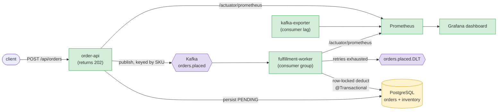

# Hermes — Reliable Transaction Processing Engine

**Charge money and sell inventory exactly once under a traffic spike — never
double-charging, never overselling, never dropping an order.**

---

## Architecture



The spine: **accept a burst without blocking (`202` + Kafka) → settle against a
scarce resource inside a row-locked, idempotent DB transaction → isolate poison
messages on a dead-letter topic → watch the backlog drain on Grafana.** The same
mechanism runs three domains: a **payments ledger** (the headline), **flash-sale
inventory**, and **async document ingestion**.

---

## The key design decision: `202 Accepted`, not `200 OK`

**The alternative I rejected:** process the order synchronously — deduct
inventory inside the HTTP request and return `200 OK` with the final outcome.
It's simpler, and the client learns immediately whether the order succeeded.

**Why it loses:** a synchronous handler holds a DB row lock for the duration of
the request, so the API's throughput is capped by how fast the *slowest*
contended row can be updated. Every buyer of a hot SKU serialises on one lock
while holding an HTTP connection open. Under a spike the thread pool fills with
threads waiting on locks, latency climbs for *all* endpoints, and the storefront
falls over — the failure mode is total, not graceful.

**What Hermes does instead:** the API persists the order as `PENDING`, publishes
to Kafka, and returns `202` in ~1.6 ms median without ever touching inventory.
Lock contention moves off the request path and into a worker pool that drains at
its own pace. A spike becomes *queue depth* — a number on a dashboard that
recovers — instead of downtime. Consumer lag is the visible pressure gauge, and
scaling workers is the visible relief valve.

**What it costs, honestly:** the client no longer learns the outcome
synchronously. It gets an order id and must poll or subscribe. That's a real
API-ergonomics tax, paid deliberately to buy availability under load — and it's
why the order-status endpoint and the SSE stream exist.

---

## Measured result

Measured **2026-08-05** on an Apple M2 (8 core / 16 GB) with Docker allocated
**4 CPU / 8 GB**, against the 200-SKU seeded catalogue.

**Throughput — `k6 run -e RATE=300 -e DURATION=60s loadtest/k6-blast.js`:**

| Metric | Result |
|---|---|
| Orders accepted | **17,955** in 60 s (**299.2/s** sustained) |
| Failed requests | **0** (0.00%) |
| Latency — median | **1.57 ms** |
| Latency — p90 / p95 | 7.99 ms / **24.17 ms** |

**Correctness under that load** — every order is accounted for, nothing oversold:

```
$ curl -s localhost:8080/api/orders/stats
{"PENDING":0,"FULFILLED":15290,"REJECTED":2665}      # 15290 + 2665 = 17955 exactly

$ psql -c "select count(*) from products where stock_available < 0"
 0        # zero SKUs oversold; 69 sold down to exactly 0
```

The backlog drained to `PENDING: 0` within 5 s of the load stopping.

**Exactly-once charging** — 200 concurrent `POST /api/payments` with the *same*
`Idempotency-Key`, verified against the database rather than the API's own counter:

```
payment rows before=18  after=19          # +1 row from 200 concurrent requests
rows for this idempotency key: 1          # charged exactly once
accounts with balance_cents < 0: 0        # never overdrawn
```

Reproduce both: `loadtest/k6-blast.js` (orders) and the stress loop under
[Payments ledger](#payments-ledger--charge-exactly-once-the-headline).

---

## Run it in under 2 minutes

```bash
docker compose up --build
```

Brings up Postgres, Kafka, both services, kafka-exporter, Prometheus and Grafana,
and seeds a 200-SKU catalogue on first boot. Then:

```bash
curl -i -X POST http://localhost:8080/api/orders \
  -H 'Content-Type: application/json' \
  -d '{"customerId":"cust-1","sku":"SKU-0007","quantity":2}'   # → 202 Accepted

curl http://localhost:8080/api/orders/stats                     # → fulfilled by the worker
```

Grafana dashboard at **http://localhost:3000**, ledger console at
**http://localhost:8080/payments**.

> **Give the Docker VM enough memory** — at least **4 CPU / 8 GB**. On a 2 GB VM
> Kafka gets OOM-killed under load (`Exited (137)`) and orders stop draining.
> colima: `colima stop && colima start --cpu 4 --memory 8`. Docker Desktop:
> Settings → Resources.

---

## Payments ledger — charge exactly once (the headline)

The hardest, most valuable version of this engine is money: a charge must apply
**exactly once**, and an account must **never go negative**, no matter how many
times a client retries.

- `POST /api/payments` carries a client-supplied **`Idempotency-Key`** (the Stripe
  pattern). A `UNIQUE` constraint on that column is the dedupe guarantee: if the
  same key races in 100× concurrently, exactly one row is created and the other 99
  return the existing payment — no second charge.
- The worker debits the account inside a row-locked `@Transactional` settlement
  ([`LedgerService`](fulfillment-worker/src/main/java/com/hermes/worker/service/LedgerService.java)),
  so concurrent charges on one account can never overdraw it.
- Consumers are idempotent, so at-least-once Kafka redelivery never double-debits.

**The double-charge stress test** — fire the same key 200× at once:

```bash
ACC=ACC-0001
for i in $(seq 1 200); do
  curl -s -o /dev/null -X POST localhost:8080/api/payments -H 'Content-Type: application/json' \
    -d '{"accountId":"ACC-0001","amountCents":1000,"idempotencyKey":"DUP-DEMO-1"}' &
done; wait
curl -s localhost:8080/api/payments/stats
# → {"PENDING":0,"APPLIED":1,"REJECTED":0,"DUPLICATES_BLOCKED":199}   ← charged ONCE
```

Then load it: `k6 run loadtest/k6-payments.js` (≈10% of charges replay an old key).
Verified: thousands of charges settle, the queue drains to 0, the
`accounts overdrawn` invariant stays **0**, and "double-charges prevented" climbs.
The live **ledger console** at `/payments` streams it all over SSE.

### Transactional outbox + Debezium CDC (no lost events)

A naive design saves the payment to Postgres and *then* publishes to Kafka — two
writes that can diverge if the process dies in between (the **dual-write problem**).
The payment path avoids it entirely:

```
POST /api/payments ─▶ order-api ──┐ one DB transaction
                                  ├─▶  payments  (the charge)
                                  └─▶  outbox_events  (the Kafka event as JSON)
                                          │ committed atomically
                          Debezium ◀──────┘ tails the Postgres WAL (logical replication)
                              └─▶ Kafka topic `payments.requested` ─▶ ledger worker settles
```

[`PaymentService`](order-api/src/main/java/com/hermes/orderapi/payment/PaymentService.java)
writes the `Payment` **and** an `outbox_events` row in **one transaction** — there is
no Kafka call in the API at all. **Debezium** (Kafka Connect, `EventRouter` SMT) tails
the WAL and ships each committed outbox row to Kafka. The event therefore exists in
Kafka *if and only if* the charge committed — exactly-once, no lost events, and the old
consume-before-commit race becomes impossible.

Proven: stop the worker, fire 15 charges, restart → **all 15 settle, nothing lost**;
fire the same idempotency key 50× → exactly **one** outbox row. It's all wired into
`docker compose up` (Postgres runs with `wal_level=logical`; a `connect-init` container
registers [the connector](infra/debezium/payments-outbox-connector.json) automatically).
*(The order path keeps the simpler direct-publish for contrast.)*

## The other design decisions

(The headline `202`-vs-`200` decision is [above](#the-key-design-decision-202-accepted-not-200-ok).)

- **Inventory is deducted under a pessimistic row lock**
  (`SELECT … FOR UPDATE`, see [`ProductRepository`](common/src/main/java/com/hermes/common/repository/ProductRepository.java)).
  Many workers can process orders for the same SKU concurrently without
  overselling, because they serialise on the product row. There's also an
  optimistic `@Version` column as a second line of defence.
- **Consumers are idempotent.** Kafka gives at-least-once delivery, so a message
  can arrive twice. The worker checks the order is still `PENDING` before acting,
  making redelivery a safe no-op — verified by a unit test.
- **Poison messages don't wedge the partition.** A failing message is retried with
  back-off, then parked on a dead-letter topic (`orders.placed.DLT`) — the same
  DLQ pattern as Argus, expressed in Spring Kafka's `DefaultErrorHandler` +
  `DeadLetterPublishingRecoverer`.
- **Producer is idempotent + `acks=all`.** No duplicate or lost events on the
  publish side either.
- **Orders are keyed by SKU on the topic**, so all orders for one product land on
  one partition and are processed in order — minimising lock contention.

## The stack

| Concern            | Choice                                             |
|--------------------|----------------------------------------------------|
| Language / runtime | Java 17                                             |
| Framework          | Spring Boot 3.3 (Web, Data JPA, Actuator, Kafka)    |
| Persistence        | PostgreSQL 16 + Hibernate, pessimistic + optimistic locking |
| Messaging          | Apache Kafka 3.8 (KRaft, no ZooKeeper)             |
| Metrics            | Micrometer → Prometheus, kafka-exporter for lag    |
| Dashboards         | Grafana (datasource + dashboard auto-provisioned)  |
| Load testing       | k6                                                 |
| Build              | Multi-module Maven, multi-stage Docker builds      |

Three modules: [`common`](common) (entities, repos, the `OrderPlacedEvent`),
[`order-api`](order-api) (REST + producer), [`fulfillment-worker`](fulfillment-worker)
(consumer + transactional fulfilment).

Everything builds and runs in Docker — no local JDK/Maven needed.

| Service    | URL                                            |
|------------|------------------------------------------------|
| Order API  | http://localhost:8080/api/orders               |
| Grafana    | http://localhost:3000 (anonymous, or admin/admin) |
| Prometheus | http://localhost:9090                          |

## The demo: blast it and watch the lag

```bash
# 150 orders/sec for 60s (defaults)
k6 run loadtest/k6-blast.js

# crank it to make the queue visibly back up
k6 run -e RATE=800 -e DURATION=2m loadtest/k6-blast.js
```

Open the **Hermes — Order Fulfillment Engine** dashboard in Grafana and watch:

- **Order ingest rate** climb to the k6 rate,
- **Kafka consumer lag** spike as orders queue up, then drain,
- **Fulfilment outcomes** split into `fulfilled` vs `rejected_out_of_stock` as
  popular SKUs sell out.

Scale the workers to drain faster and watch the lag fall:

```bash
docker compose up -d --scale fulfillment-worker=3
```

## Live dashboard (Next.js + SSE)

[`frontend/`](frontend) is a Next.js "live drop console" that streams the queue
in real time over **Server-Sent Events** — no polling. The API exposes
`GET /api/metrics/stream` ([`MetricsController`](order-api/src/main/java/com/hermes/orderapi/metrics/MetricsController.java)):
a single background thread samples order counts + throughput every 500ms and
fans the JSON snapshot out to every open connection. The page consumes it with
the native `EventSource` API, so the charts move the instant k6 fires.

```bash
cd frontend
npm install
NEXT_PUBLIC_HERMES_API_BASE_URL=http://localhost:8080 npm run dev -- -p 3001
# open http://localhost:3001  (unset the env var to run the self-contained DEMO simulator)
```

## Using the real Olist dataset

The synthetic catalogue makes the repo run instantly. To use the real
**Brazilian E-Commerce Public Dataset by Olist** (~33k products, ~100k orders),
download the CSVs and run `scripts/load_olist.py` — see [`data/README.md`](data/README.md).

## Tests

```bash
mvn test
```

- [`FulfillmentServiceTest`](fulfillment-worker/src/test/java/com/hermes/worker/service/FulfillmentServiceTest.java)
  — fulfilment, out-of-stock rejection, unknown product, and **idempotent
  redelivery**, all against an in-memory DB (no Kafka/Postgres needed).
- [`OrderControllerTest`](order-api/src/test/java/com/hermes/orderapi/web/OrderControllerTest.java)
  — validation + that accepting an order publishes the right event.

CI runs `mvn verify` on every push ([ci.yml](.github/workflows/ci.yml)).

## What I'd do next

- **Transactional outbox + Debezium CDC** — ✅ done on the payments path (see above).
  Next: extend it to the order path too, and add a relay-lag metric to the dashboard.
- **Saga / compensation**: reservation → payment → shipping as separate steps,
  with compensating actions if a later step fails.
- **Per-service databases**: split orders and inventory into their own schemas to
  make the microservice boundary real, syncing via events.
- **Schema registry** (Avro/Protobuf) instead of JSON for forward/backward-compatible
  event evolution.
- **Autoscale workers on lag** — drive replica count off the `kafka_consumergroup_lag`
  metric the dashboard already exposes.
```
